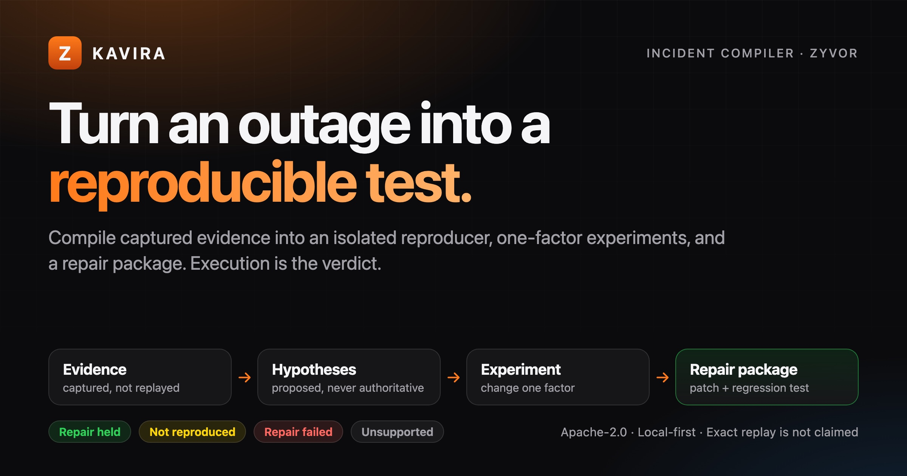
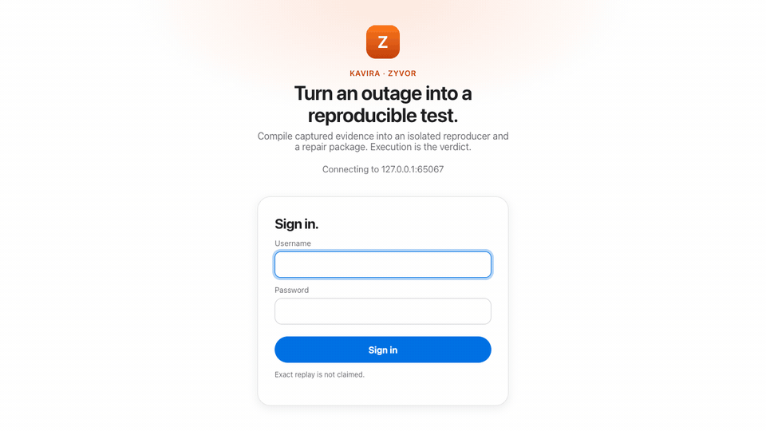
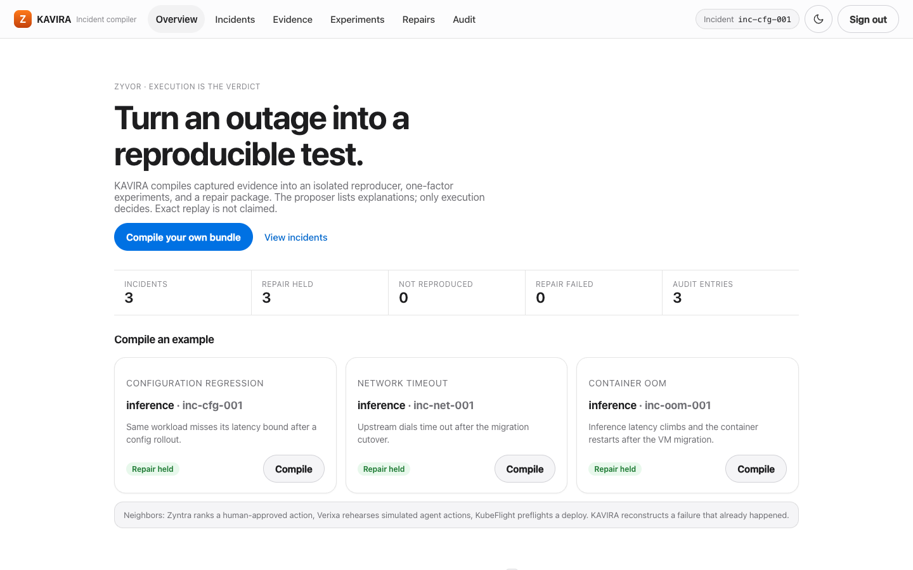
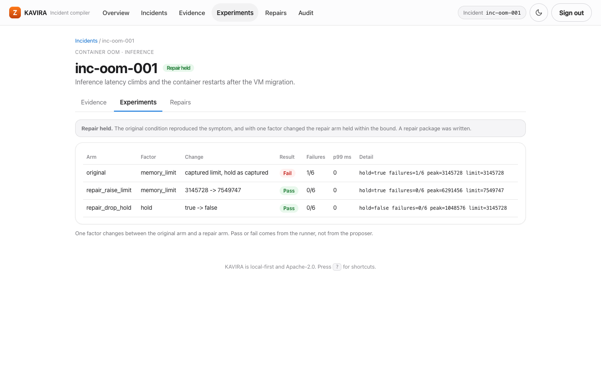
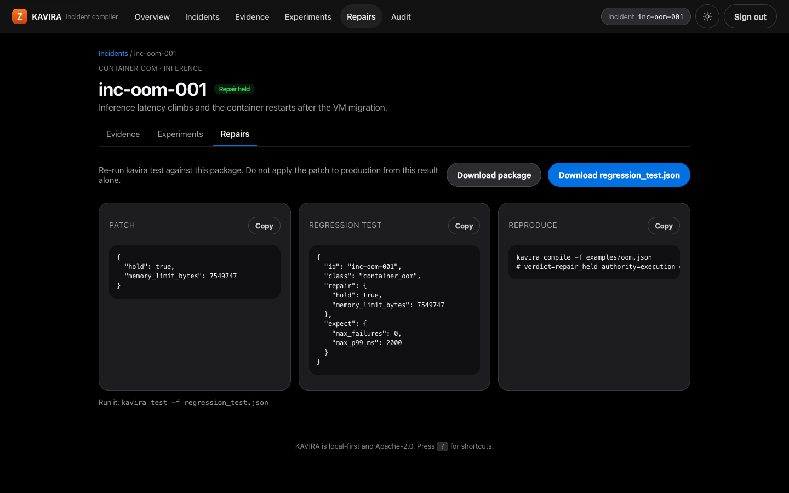
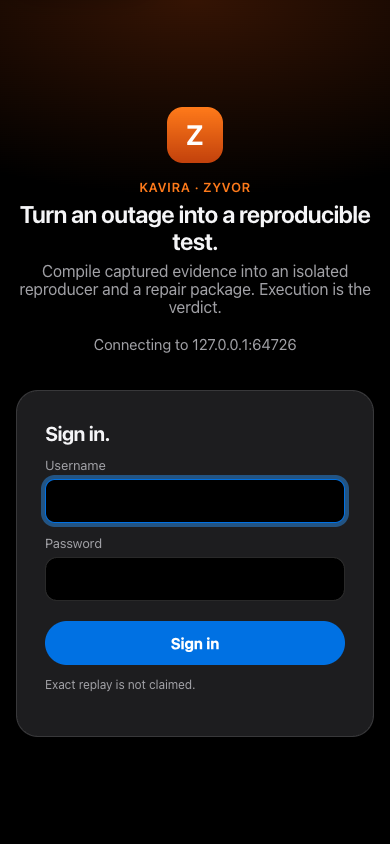
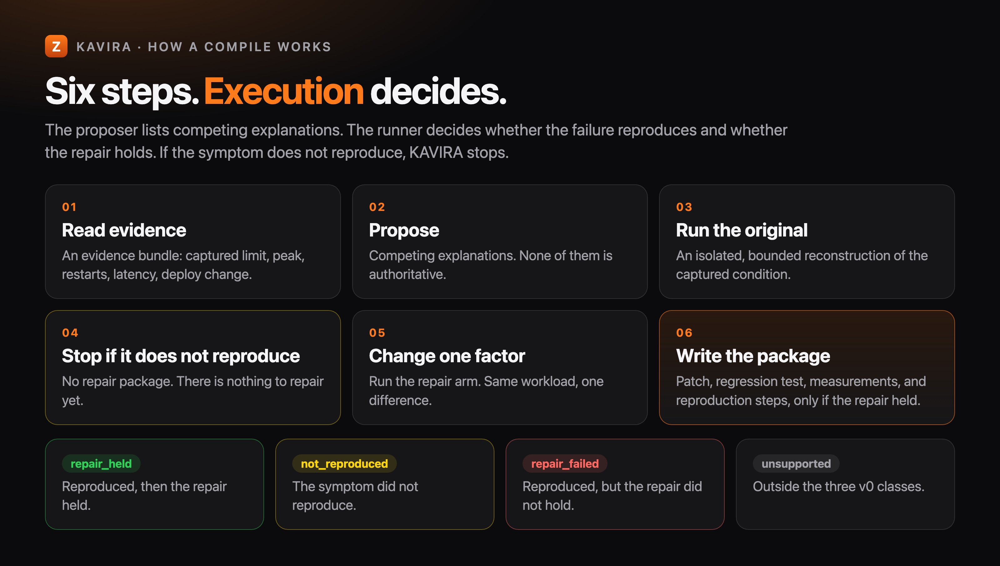
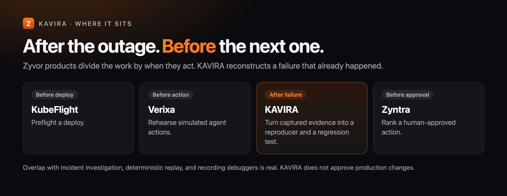
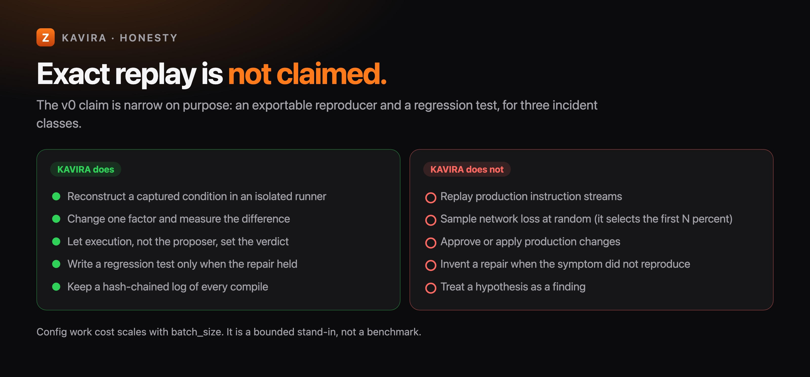

<div align="center">

# KAVIRA

[](https://github.com/zyvorai/kavira/actions/workflows/ci.yml)
[](LICENSE)
[](go.mod)
[](go.mod)
[](https://zyvorai.github.io/kavira/)



### Turn an outage into a reproducible test, and keep it from returning.

**KAVIRA compiles captured production evidence into an isolated reproducer, one-factor experiments, and a repair package.** The proposer lists competing explanations. Execution decides whether the failure reproduces and whether the repair holds.

**Execution is the verdict** · **Exact replay is not claimed** · **Local-first** · **Zero dependencies** · **Three incident classes**

🎮 **[Live demo](https://zyvorai.github.io/kavira/demo/)** · 📖 **[Site](https://zyvorai.github.io/kavira/)** · 🚀 **[Quickstart](#quickstart)** · 🔒 **[Security](SECURITY.md)**

</div>

## Why KAVIRA

| When this happens | KAVIRA gives you |
| --- | --- |
| The postmortem says "raise the memory limit" and nobody can show it would have worked | A bounded workload under the captured limit, then the same workload with one factor changed |
| A fix ships and the same outage returns next quarter | A regression test that fails on the old condition and passes on the repaired one |
| Three plausible root causes, one afternoon | Competing explanations, each tied to the experiment that would test it, and a verdict from execution |
| The symptom does not reproduce | An honest `not_reproduced`. No repair package is invented |

## See it

**[Try the live demo](https://zyvorai.github.io/kavira/demo/)**: the real console running in your browser on precompiled results (no server, nothing to install).



*Sign in, compile an example, read the evidence, the experiment arms, and the repair package. About 15 seconds, recorded against a real `kavira serve`.*

| Overview | Experiments |
| --- | --- |
|  |  |

| Repairs (dark) | Sign in (390px, dark) |
| --- | --- |
|  |  |

The console follows the Zyvor [UX contract](docs/design/UX-CONTRACT.md), shared with Netra: Apple light by default, dark one click away (or follows your OS), keyboard-first (`?` lists the shortcuts), and no horizontal scroll at 390px.

## v0 classes

| Incident | Experiment | Repair check |
| --- | --- | --- |
| Container OOM | Bounded workload under the captured memory limit | Failures, memory, latency bound |
| Network timeout | Selected delay, loss, or policy on a local listener | Recovery and connectivity |
| Configuration regression | Previous and current configs, same workload | Behavior diff and a regression test |

## Quickstart

```bash
git clone https://github.com/zyvorai/kavira.git && cd kavira
make check                                  # gofmt, vet, race tests, build
./bin/kavira compile -f examples/oom.json -o repairs
./bin/kavira test -f repairs/inc-oom-001/regression_test.json
./bin/kavira serve                          # http://127.0.0.1:8080
```

Sign in as `admin` / `Admin@321`. That pair is the **demo gate**, shared with Netra. It exists only until `KAVIRA_ADMIN_PASSWORD` is set, the login page says so while it is on, and `/api/v1/health` reports `"demo_gate": true`.

**Docker**

```bash
docker build -t kavira .
docker run --rm -p 8080:8080 \
  -e KAVIRA_ADMIN_PASSWORD='choose-a-long-one' \
  -e KAVIRA_SESSION_KEY="$(openssl rand -hex 32)" kavira
```

### Configuration

| Variable | Default | Purpose |
| --- | --- | --- |
| `KAVIRA_ADMIN_PASSWORD` | `Admin@321` (demo gate) | Password for the `admin` user. Set it to turn the demo gate off |
| `KAVIRA_SESSION_KEY` | built-in dev key | HMAC key for session cookies. Set it on anything reachable by others |
| `KAVIRA_COOKIE_SECURE` | unset | `1` adds the `Secure` flag. Use it behind TLS |

`kavira serve -addr 0.0.0.0:8080` listens beyond loopback and prints a warning if the default password or key is still in use, or if it is serving plain HTTP.

**HTTPS** is built in, standard library only:

```bash
kavira serve -addr :8443 -tls-cert cert.pem -tls-key key.pem          # your certificate
kavira serve -addr :8443 -tls-self-signed ~/.kavira/tls -tls-host 203.0.113.7   # lab: generated once, reused
```

When KAVIRA terminates TLS the session cookie is always `Secure`. A self-signed certificate makes browsers warn once.

## What a compile does



1. Read the evidence bundle.
2. Propose competing explanations. None of them are authoritative.
3. Run the original condition.
4. If the symptom does not reproduce, stop. No repair package.
5. Change one factor and run the repair arm.
6. Write patch, regression test, measurements, and reproduction instructions only if the repair holds.

Verdicts: `not_reproduced`, `repair_failed`, `repair_held`, `unsupported`.

## Console

| Page | What it shows |
| --- | --- |
| Overview | Metric band, the three examples (compile in one click), and "Compile your own bundle" (paste or upload JSON, 1 MiB max) |
| Incidents | Search, verdict filter, sortable table |
| Evidence | Authority, captured evidence, competing explanations, measurements |
| Experiments | Every arm: factor, change, result, failures, p99, detail, and why the verdict is what it is |
| Repairs | Patch, regression test, reproduce steps. Copy buttons, download `regression_test.json` or the whole package |
| Audit | Hash-chained compile log with a "chain verified" check |

Routes are hash-based (`#/incidents/inc-oom-001/repairs`), so every view is linkable and survives reload.

## API

All `/api/v1` routes except `health` and `session` need the `kavira_session` cookie. Errors are `{"error": "…"}`.

| Method and path | Purpose |
| --- | --- |
| `GET /api/v1/health` | `{ok, product, exact_replay:false, demo_gate}` |
| `GET /api/v1/session` | `{authenticated}`. Never a 401, so a signed-out page load is quiet |
| `POST /api/v1/session` | Sign in with `{username, password}` (JSON only) |
| `POST /api/v1/logout` | Clear the cookie |
| `GET /api/v1/incidents` | Compiled incidents, sorted by ID |
| `GET /api/v1/incidents/{id}` | `{incident, bundle}` |
| `POST /api/v1/compile` | `{"fixture": "oom"}` or a raw evidence bundle (≤ 1 MiB) |
| `GET /api/v1/fixtures` | Embedded examples with class and symptom |
| `GET /api/v1/audit` | Hash-chained log and `chain_ok` |

## Where it sits



| Product | Role next to KAVIRA |
| --- | --- |
| [Zyntra](https://github.com/zyvorai/zyntra) | Rank a human-approved action. KAVIRA does not approve production changes. |
| [Verixa](https://github.com/zyvorai/verixa) | Rehearse simulated agent actions. KAVIRA runs the isolated workload. |
| [KubeFlight](https://github.com/zyvorai/kubeflight) | Preflight a deploy. KAVIRA reconstructs a failure that already happened. |

Overlap with incident investigation, deterministic replay, and recording debuggers is real. The v0 claim is the exportable reproducer plus the regression test, for these three classes only.

## Honesty



- Runners reconstruct captured conditions. They do not replay production instruction streams.
- Network loss is selected (first N percent of attempts), not a random sample.
- Config work cost scales with `batch_size`. It is a bounded stand-in.
- Do not apply a patch to production from this result alone.

## Deploy

KAVIRA is one static binary with the console embedded.

```bash
./scripts/deploy-remote.sh user@host            # build, rsync, systemd user service, HTTPS (self-signed), verify
./scripts/deploy-remote.sh host user --demo     # test host: keep the demo login, like Netra
```

See [deploy/README.md](deploy/README.md) for the release image, `docker compose`, Kubernetes (kustomize), and how to verify the signed image.

## Documentation map

| I want to… | Read |
| --- | --- |
| Understand the design rules of the console | [docs/design/UX-CONTRACT.md](docs/design/UX-CONTRACT.md) |
| Deploy it | [deploy/README.md](deploy/README.md) |
| Report a vulnerability | [SECURITY.md](SECURITY.md) |
| Contribute | [CONTRIBUTING.md](CONTRIBUTING.md), [AGENTS.md](AGENTS.md) |
| See what changed | [CHANGELOG.md](CHANGELOG.md) |
| Regenerate screenshots, the demo GIF, and social images | [docs/README.md](docs/README.md) |

## Maturity

| Area | Status |
| --- | --- |
| Three v0 incident classes | Working, covered by tests and CI |
| Console | Working. Browser end-to-end suite runs every route in light, dark, and 390px |
| Auth | Single `admin` user, HMAC cookie. A demo gate, not an identity system |
| State | In memory. A restart clears incidents and the audit log |
| Model-proposed hypotheses | Not in v0. Proposals are rules over the bundle |

## License

[Apache-2.0](LICENSE). Copyright 2026 Zyvor AI Labs.

<div align="center">

**Turn an outage into a reproducible test.** · [Docs](https://zyvorai.github.io/kavira/) · [Quickstart](#quickstart) · [Security](SECURITY.md)

</div>
